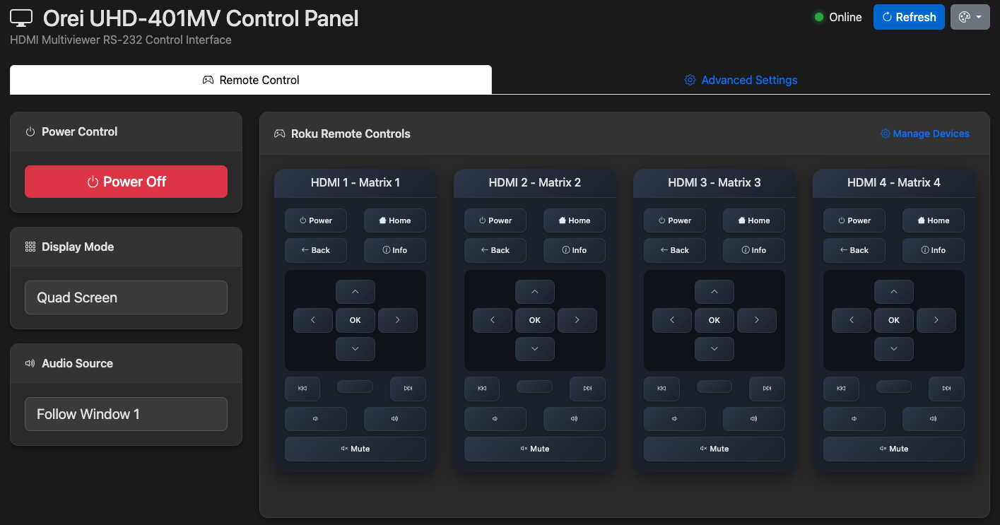
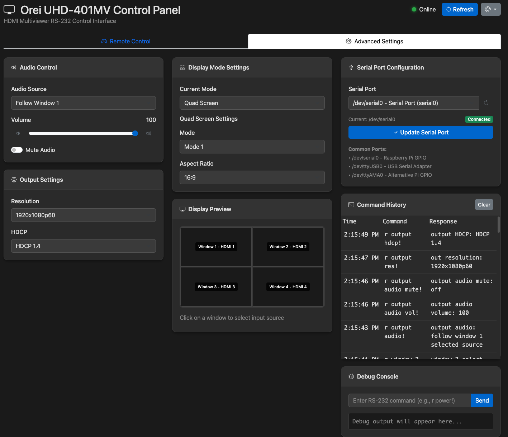
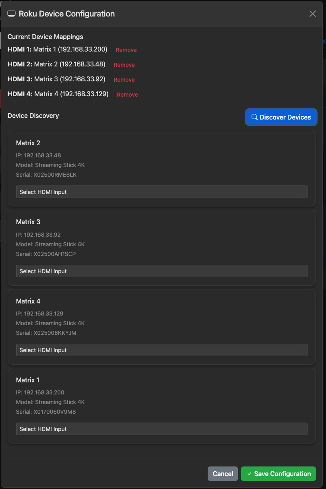

# Orei UHD-401MV Control Panel

A comprehensive web-based control interface for the Orei UHD-401MV HDMI Multiviewer with RS-232 communication and integrated Roku device control.

## Screenshots

### Main Interface - Remote Control Tab

*Remote control interface with integrated Roku device controls and responsive layout*

### Advanced Settings & Display Preview  

*Advanced settings with real-time display mode preview and window input assignment*

### Roku Device Configuration

*Modal-based Roku device discovery and mapping interface*

## Features

### Core Device Control
- **Power Control**: Turn the multiviewer device on/off
- **Display Modes**: Single, PIP, PBP, Triple, and Quad screen modes with real-time preview
- **Audio Control**: Volume slider with up/down buttons, mute toggle, and source selection
- **Window Input Assignment**: Interactive display diagram for setting HDMI inputs per window
- **Output Settings**: Resolution and HDCP configuration
- **Advanced Mode Settings**: Position, size, and aspect ratio controls for each display mode

### Roku Integration
- **Device Discovery**: Automatic network scanning for Roku devices using SSDP and network probing
- **Device Management**: Modal-based configuration interface for mapping Roku devices to display windows
- **Remote Controls**: Dynamic Roku remote interfaces that appear based on current display mode
- **Window-Aware Remotes**: Only shows remotes for visible display windows
- **Horizontal Layout**: Optimized side-by-side remote layout for multi-window modes

### User Interface
- **Theme Support**: Auto, Light, and Dark themes with full modal and component coverage
- **Responsive Design**: Optimized for desktop, tablet, and mobile devices
- **Tab Navigation**: Separate Remote Control and Advanced Settings tabs
- **Modal Dialogs**: Non-intrusive device configuration workflow
- **Real-time Updates**: Event-driven UI updates when settings change
- **Toast Notifications**: User feedback for all actions and status changes

### Technical Features
- **Rate-Limited Commands**: Prevents RS-232 communication overload
- **Command History**: Track all RS-232 commands and responses
- **Debug Console**: Send custom commands for testing and troubleshooting
- **Sequential Processing**: Eliminates command conflicts and garbled responses
- **Error Recovery**: Automatic retry logic and graceful failure handling

## Recent Major Improvements

### Roku Device Integration (v2.0)
- Complete Roku device discovery and control system
- Modal-based device management workflow
- Dynamic remote controls based on display configuration
- Network scanning with multi-threaded device discovery
- Automatic device mapping and persistence

### UI/UX Enhancements
- **Dark Mode**: Full dark theme support across all components including modals
- **Tablet Optimization**: Larger touch targets and improved layout for tablet usage
- **Horizontal Remote Layout**: Fixed side-by-side Roku remote positioning
- **Modal Interface**: Clean device configuration without disrupting main interface
- **Volume Controls**: Added increment/decrement buttons alongside slider

### Bug Fixes & Optimizations
- **Volume Synchronization**: Fixed slider to show actual device volume instead of default 50
- **Window Input Loading**: Resolved browser refresh issues in quad mode
- **Duplicate ID Prevention**: Fixed modal functionality conflicts
- **Focus Management**: Proper modal accessibility and close behavior
- **Command Sequencing**: Eliminated RS-232 response corruption from parallel commands

### Code Quality
- **Modular Architecture**: Organized JavaScript modules for maintainability
- **Event-Driven Design**: Proper event handling for component communication
- **Error Handling**: Comprehensive error recovery and user feedback
- **Performance**: Optimized command execution and UI updates
- **Accessibility**: WCAG-compliant interface with proper ARIA attributes

## Quick Start

1. **Hardware Setup**: Connect RS-232 cable between Raspberry Pi and Orei UHD-401MV
2. **Install**: Run `./setup.sh` on fresh Raspberry Pi OS
3. **Configure**: Access web interface at `http://your-pi-ip`
4. **Roku Setup**: Use "Configure Roku Devices" to discover and map your Roku devices
5. **Control**: Use the interface to control both the multiviewer and connected Roku devices

## Installation

### Automated Setup (Recommended)
```bash
git clone <repository-url>
cd orei-control
chmod +x setup.sh
./setup.sh
```

### Manual Installation
```bash
# Install dependencies
sudo apt update && sudo apt install -y python3-pip python3-venv netcat-openbsd

# Create virtual environment
python3 -m venv venv
source venv/bin/activate

# Install Python packages
pip install -r requirements.txt

# Start development server
python app.py
```

## Usage Guide

### Initial Setup
1. Power on the Orei UHD-401MV device
2. Access the web interface
3. Click "Refresh" to load current device settings
4. Go to "Configure Roku Devices" to set up streaming device control

### Basic Operation
- **Power**: Toggle device power with the power button
- **Display Mode**: Select layout from dropdown (updates real-time preview)
- **Window Inputs**: Click windows in the diagram to assign HDMI sources
- **Audio**: Use volume slider/buttons and select audio source
- **Roku Control**: Use virtual remotes that appear for active display windows

### Advanced Features
- **Theme Selection**: Use theme dropdown in header to switch between light/dark modes
- **Debug Console**: Send custom RS-232 commands in Advanced Settings tab
- **Command History**: Monitor all device communication for troubleshooting
- **Modal Management**: Configure Roku devices without leaving current context

### Roku Device Setup
1. Click "Configure Roku Devices" or "Manage Devices" button
2. Click "Discover Devices" to scan your network
3. Select discovered devices and assign them to display windows
4. Click "Save Configuration" to apply mappings
5. Roku remotes will automatically appear for assigned windows

## Configuration

### RS-232 Settings
- **Port**: `/dev/serial0` (Raspberry Pi GPIO) or `/dev/ttyUSB0` (USB adapter)
- **Baud Rate**: 115200
- **Data Bits**: 8, Stop Bits: 1, Parity: None
- **Timeout**: 2 seconds
- **Command Delay**: 200ms between sequential commands

### Network Requirements
- **Roku Discovery**: Devices must be on same subnet as Raspberry Pi
- **Ports**: TCP 8060 (Roku ECP), UDP 1900 (SSDP discovery)
- **Dependencies**: `netcat-openbsd` package for network scanning

### Device Compatibility
- **Multiviewer**: Orei UHD-401MV (tested with ASCII command protocol)
- **Roku Devices**: All modern Roku devices with External Control Protocol (ECP)
- **Network**: IPv4 networks with multicast support

## File Structure

```
├── app.py                          # Flask backend with API endpoints
├── static/
│   ├── index.html                  # Main responsive UI
│   ├── styles.css                  # Complete theme system and responsive design
│   └── js/
│       ├── main.js                 # Application initialization
│       ├── api.js                  # Rate-limited API client
│       ├── device.js               # Multiviewer device control
│       ├── display.js              # Display diagram and mode management
│       ├── audio.js                # Audio control functions
│       ├── roku.js                 # Roku device discovery and control
│       ├── commands.js             # Command history management
│       ├── theme.js                # Theme switching system
│       └── utils.js                # Shared utilities and toast notifications
├── requirements.txt                # Python dependencies
├── setup.sh                       # Automated installation script
└── README.md                       # This file
```

## API Endpoints

### Device Control
- `POST /api/command` - Send RS-232 command to multiviewer
- `GET /api/status` - Get device power and connection status

### Roku Integration
- `POST /api/roku/discover` - Discover Roku devices on network
- `POST /api/roku/command` - Send ECP command to specific Roku device
- `GET /api/roku/devices` - Get configured device mappings
- `POST /api/roku/devices` - Save device mapping configuration

## Troubleshooting

### Common Issues

**"No response" from device:**
- Check RS-232 cable connection and port configuration
- Verify device is powered on
- Ensure no other processes are using the serial port
- Try manual command: `echo "r power!" > /dev/serial0`

**Roku devices not discovered:**
- Verify `netcat-openbsd` package is installed: `sudo apt install netcat-openbsd`
- Check devices are on same network subnet
- Ensure multicast traffic is not blocked by router/firewall
- Try manual discovery: `nmap -p 8060 192.168.1.0/24`

**Volume slider shows wrong value:**
- Click "Refresh" to reload current device settings
- Check command history for RS-232 communication errors
- Volume may take a few seconds to update after device changes

**Interface not loading properly:**
- Clear browser cache and reload page
- Check browser console for JavaScript errors
- Verify Flask server is running: `sudo systemctl status orei-control`

### Debug Tools

**Command History**: Monitor RS-232 communication in Advanced Settings tab

**Debug Console**: Send custom commands like:
- `r power!` - Check power status
- `r multiview!` - Get current display mode
- `s multiview 5!` - Set quad screen mode

**System Logs**: 
```bash
sudo journalctl -u orei-control.service -f
```

**Network Scanning**:
```bash
# Manual Roku discovery
nmap -p 8060 --open $(ip route | grep 'scope link' | awk '{print $1}' | head -1)
```

## Development

### Architecture
- **Frontend**: Vanilla JavaScript with modular ES6 design
- **Backend**: Flask with rate-limited RS-232 communication
- **Styling**: Bootstrap 5 with custom CSS variables for theming
- **Communication**: RESTful API with WebSocket-like real-time updates

### Key Design Patterns
- **Event-Driven**: Component communication via custom events
- **Rate-Limited**: All device communication respects hardware limitations
- **Responsive**: Mobile-first design with tablet optimizations
- **Accessible**: WCAG 2.1 AA compliance with proper ARIA usage

### Contributing
1. Fork repository and create feature branch
2. Test on actual hardware (Raspberry Pi + Orei device)
3. Verify both light and dark themes
4. Test Roku integration with multiple devices
5. Submit pull request with detailed description

## License

MIT License - see LICENSE file for details.

## Support

For issues, feature requests, or questions:
1. Check troubleshooting section above
2. Review command history and system logs
3. Create GitHub issue with detailed information including:
   - Hardware setup description
   - Error messages or unexpected behavior
   - Browser console output
   - System logs from `journalctl`
